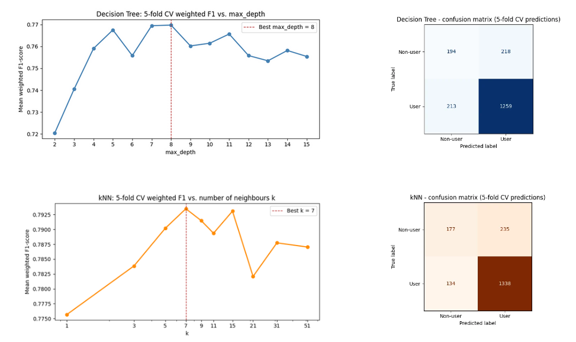
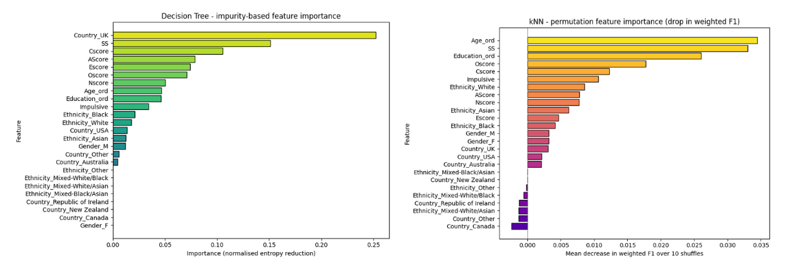

# Drug Consumption Analysis

<p align="center">
  
  
  
  
</p>

<p align="center">
  A data science project analysing drug consumption patterns across 1,884 survey respondents, combining personality profiling with demographic data and self-reported substance use.
</p>

---

## Overview

This repository documents the complete data analysis of the **Drug Consumption** dataset from the UCI Machine Learning Repository (Fehrman et al., 2017). The analysis is structured in three sequential phases:

| Phase | Topic | Status |
|:---:|---|:---:|
| 1 | [Exploratory data analysis](#part-1---exploratory-data-analysis) | Complete |
| 2 | [Classification](#part-2---classification) | Complete |
| 3 | [Regression](#part-3---regression) | Upcoming |

---

## Dataset

The dataset records the drug consumption behaviour of **1,884 respondents**, collected via an online survey between 2011 and 2012. Each row contains:

- **Demographics** - Age, Gender, Education, Country, Ethnicity *(nominal / ordinal)*
- **Personality scores** - Neuroticism, Extraversion, Openness, Agreeableness, Conscientiousness, Impulsiveness, Sensation Seeking *(continuous z-scores, NEO-PI-R model)*
- **Drug consumption** - 18 substances rated on a 7-level ordinal scale from `CL0` (never used) to `CL6` (last day)

> **Note on Semer:** The survey includes a fictitious drug as a validity check. Only **0.4%** of respondents claimed to have used it, confirming general data reliability.

---

## Part 1 - Exploratory Data Analysis

### Sample Characteristics

The sample is nearly gender-balanced (943 male, 941 female) but skewed toward younger, more educated respondents, with over 55% originating from the United Kingdom.

<p align="center">
  
</p>
<p align="center"><em>Figure 1 - Demographic distribution: gender, age group, and country of residence.</em></p>

---

### Personality Scores

All seven personality scores are approximately normally distributed and centred near zero, consistent with their z-score standardisation. The close alignment of mean and median across all features confirms approximate symmetry.

<p align="center">
  
</p>
<p align="center"><em>Figure 2 - Distribution of the seven personality scores.</em></p>

| Feature | Mean | Median | Std Dev | IQR |
|---|---:|---:|---:|---:|
| Nscore (Neuroticism) | −0.0001 | 0.0426 | 0.998 | 1.308 |
| Escore (Extraversion) | 0.0001 | 0.0033 | 0.997 | 1.333 |
| Oscore (Openness) | −0.0002 | −0.0193 | 0.996 | 1.441 |
| AScore (Agreeableness) | 0.0002 | −0.0173 | 0.997 | 1.367 |
| Cscore (Conscientiousness) | −0.0004 | −0.0066 | 0.998 | 1.237 |
| Impulsive | 0.0073 | −0.2171 | 0.954 | 1.241 |
| SS (Sensation Seeking) | −0.0027 | 0.0799 | 0.963 | 1.291 |

---

### Legal vs. Illegal Substances

Legal substances show substantially higher recent use than illegal ones. Caffeine leads with **73.5%** of respondents at CL6 (last day), while Heroin has **85.1%** at CL0 (never used).

<p align="center">
  
</p>
<p align="center"><em>Figure 3 - Consumption frequency for selected substances across the legal–illegal spectrum.</em></p>

---

### Sensation Seeking Across Age Groups

Sensation Seeking declines monotonically with age - from a mean of **+0.40** in the 18–24 group to **−0.97** in the 65+ group - consistent with established findings in personality psychology.

<p align="center">
  
</p>
<p align="center"><em>Figure 4 - Mean Sensation Seeking score by age group, with reference line at z = 0.</em></p>

---

### Outlier Detection

Two methods were applied: the **3-sigma rule** (Definition 5.1.1) and the **IQR rule** (Definition 5.1.3). Both identify only a small number of extreme values per feature (≤ 1.3% of observations). Given that scores originate from a validated psychometric instrument, these extremes most plausibly represent genuine individual differences rather than measurement errors - **removal is not justified**.

<p align="center">
  
</p>
<p align="center"><em>Figure 5 - Boxplot overview of all personality features; points beyond the whiskers are flagged by the IQR rule.</em></p>

---

### Key Findings Summary

| # | Finding |
|:---:|---|
| 1 | **No missing values** - mandatory survey design ensured complete data across all 1,884 rows |
| 2 | **Sample skew** - younger respondents (18–34) and UK-based participants are overrepresented |
| 3 | **Normal personality distributions** - all scores centred near zero with std ≈ 1 |
| 4 | **Clear legal/illegal divide** - Caffeine and Alcohol heavily used; hard drugs rarely so |
| 5 | **Age–SS relationship** - Sensation Seeking decreases steadily from 18–24 to 65+ |
| 6 | **Outliers retained** - few in number and plausibly genuine; robust measures preferred |
| 7 | **Valid responses** - Semer fictitious drug claimed by only 0.4% of participants |

---

## Part 2 - Classification

Building on the EDA hypothesis that personality traits predict substance exposure, this phase formalises a binary prediction task and contrasts two classifiers: **Decision Tree** and **k-Nearest Neighbour**.

---

### Classification Task

The target variable is constructed by binarising the Cannabis column at the `CL0` boundary:

- **Class 0 - Non-user**: respondents reporting `CL0` (never used Cannabis).
- **Class 1 - User**: respondents reporting any of `CL1`-`CL6` (used at least once).

| Class | Count | Proportion |
|---|---:|---:|
| Non-user (0) | 412 | 21.9% |
| User (1) | 1,472 | 78.1% |

The target classes are moderately imbalanced, motivating the use of weighted F1 alongside accuracy and **stratified** k-fold cross-validation.

---

### Methodology

**Predictors:** 7 personality z-scores + 5 demographic features (2 ordinal-encoded, 3 one-hot), yielding a 25-column feature matrix. All drug columns are excluded to prevent data leakage.

**Preprocessing:** ordinal integer encoding for Age and Education; one-hot dummies for Gender, Country, and Ethnicity; Min-Max scaling of the full feature matrix for kNN (invariant for the Decision Tree).

**Validation:** Stratified 5-fold cross-validation (`random_state=42`); hyperparameters tuned by maximising mean weighted F1 across folds.

---

### Cross-Validation Results


<p align="center">
  
</p>
<p align="center"><em>Figure 6 - Model comparison of accuracy & F1-score between Decision Tree & kNN.</em></p>

| Classifier | Tuned parameter | Accuracy | Weighted F1 |
|---|:---:|---:|---:|
| Decision Tree (`criterion=entropy`) | `max_depth = 8` | 0.7712 ± 0.0155 | 0.7697 ± 0.0133 |
| k-Nearest Neighbour (*Euclidean*) | `k = 7` | 0.8041 ± 0.0123 | 0.7935 ± 0.0143 |

> A majority-class baseline would yield 78.1% accuracy. The Decision Tree sits close to this ceiling; kNN clears it by ~2.6%. Both models identify *users* well (recall ≈ 86 - 91%) but struggle on the minority *non-user* class (recall ≈ 43 - 47%).

---

### Feature Importance

Two complementary methods are applied: **impurity-based importance** (Decision Tree) and **permutation importance** (kNN, 10 repeats, drop in weighted F1).

<p align="center">
  
</p>
<p align="center"><em>Figure 7 - Feature importance comparison between Decision Tree & kNN.</em></p>

| Rank | Decision Tree - impurity reduction | kNN - permutation drop in F1 |
|:---:|---|---|
| 1 | Country_UK (0.2526) | SS - Sensation Seeking (0.0388) |
| 2 | SS - Sensation Seeking (0.1513) | Age_ord (0.0201) |
| 3 | Cscore - Conscientiousness (0.1054) | Oscore - Openness (0.0186) |

The class-conditional means of the top personality features confirm real but modest effect sizes:

| Feature | Non-users | Users | Difference |
|---|---:|---:|---:|
| SS (Sensation Seeking) | -0.652 | +0.179 | +0.831 |
| Oscore (Openness) | -0.579 | +0.162 | +0.741 |
| Age_ord | 1.981 | 1.168 | -0.813 |
| Cscore (Conscientiousness) | +0.451 | -0.127 | -0.577 |

---

### Key Findings Summary

| # | Finding |
|:---:|---|
| 1 | **kNN outperforms the Decision Tree**: 80.4% vs 77.1% accuracy; 0.7935 vs 0.7697 weighted F1 under 5-fold CV |
| 2 | **Sensation Seeking is the strongest and most reliable predictor**: top-ranked by kNN permutation importance and second by the Decision Tree |
| 3 | **Country_UK distorts tree splits**: the Decision Tree places it first due to sample over-representation (55% UK), not a causal mechanism |
| 4 | **Minority class recall is the key limitation**: non-user recall of 43 - 47% reflects the 76/24 class imbalance and the modest effect sizes of personality predictors (~0.6 - 0.8 SD difference) |
| 5 | **EDA hypothesis partially confirmed**: Sensation Seeking, Openness, and younger age are associated with Cannabis use, but effect sizes are insufficient to override the class prior for borderline profiles |

---

## Part 3 - Regression

---

## Repository Structure

```
drug-consumption-analysis/
│
├── explorative-data-analysis/
│   ├── EDAnotebook.ipynb                # Jupyter Notebook - Part 1
│   └── explorative-data-analysis.pdf    # Documentation - Part 1
│
├── classification/
│   ├── classification-notebook.ipynb    # Jupyter Notebook - Part 2
│   └── classification.pdf               # Documentation - Part 2
│
├── results/
│   └── *.png                            # Output figures
│
├── .gitignore
├── Drug_Consumption.csv                 # Dataset
└── README.md
```

---

## Dependencies

```python
import os
import numpy as np
import pandas as pd
import matplotlib.pyplot as plt
from sklearn.preprocessing import LabelEncoder, MinMaxScaler
from sklearn.model_selection import StratifiedKFold, cross_val_score, cross_val_predict
from sklearn.metrics import confusion_matrix, ConfusionMatrixDisplay, classification_report
from sklearn import tree
from sklearn.neighbors import KNeighborsClassifier, NearestNeighbors
from sklearn.inspection import permutation_importance
from IPython.display import display, Markdown
```

---

## Reference

Fehrman, E., Muhammad, A. K., Mirkes, E. M., Egan, V., & Gorban, A. N. (2017). *The Five Factor Model of personality and evaluation of drug consumption risk.* In Palumbo, Montanari & Vichi (Eds.), Data Science: Innovative Developments in Data Analysis and Clustering (pp. 231–242). Springer.

Dataset available at: [UCI ML Repository - Drug Consumption (Quantified)](https://archive.ics.uci.edu/dataset/373/drug+consumption+quantified)
