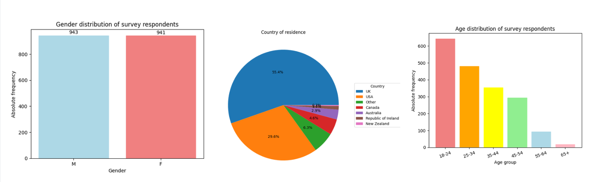
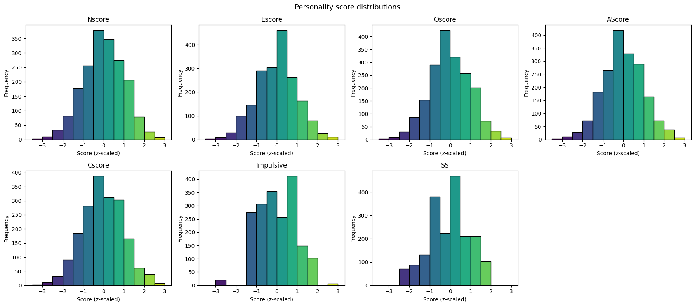
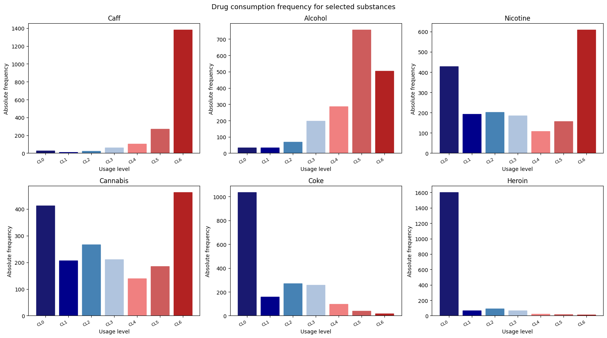
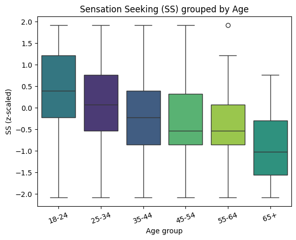
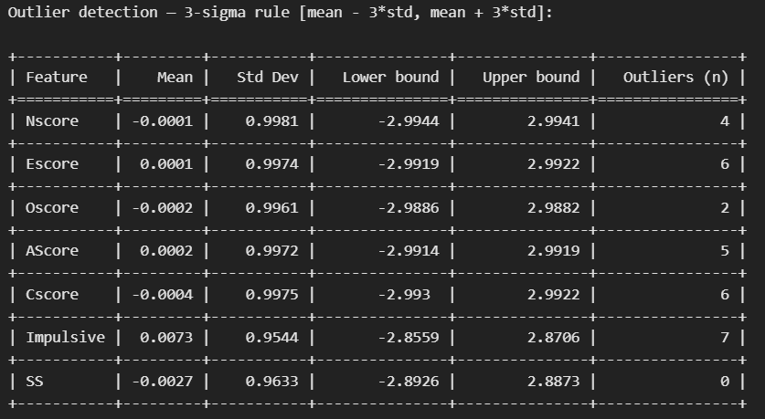

## Objectives
The aim of this repository is to perform an analysis on the data of the `Drug_Consumption.csv` dataset, that contains information about drug consumption of 1885 participants.
The analysis will be performed in 3 different phases:
#### 1. Exploratory Data Analysis

The exploratory data analysis of the Drug Consumption dataset concludes with the following findings:

1. **No missing values** — the mandatory survey design ensured completeness across all 1,884 rows and 31 features.

2. **Sample characteristics** — nearly gender-balanced (943 male, 941 female), skewed toward younger respondents (643 in the 18–24 group), and dominated by UK participants (1,043 out of 1,884). 

3. **Personality scores** are approximately normally distributed and centred near zero (mean ≈ 0, std ≈ 1), consistent with their z-score standardisation. Mean and median are nearly identical for all scores, confirming approximate symmetry. 

4. **Legal substances** show far higher recent use (Caffeine mode CL6 at 73.5%; Alcohol mode CL5 at 40.2%) than illegal ones (Heroin mode CL0 at 85.1%; Cocaine mode CL0 at 55.0%). 

5. **Sensation Seeking declines steadily with age** — from a mean of +0.40 in the 18–24 group to −0.97 in the 65+ group. 

6. **Outliers** are few in every personality score and plausibly represent genuine extremes; no removal is justified. 

7. **Semer validity check** — only 8 respondents (0.4%) claimed use of the fictitious substance, confirming general data reliability.

#### 2. Classification

#### 3. Regression
