# Drug Consumption Analysis

<p align="center">
  
  
  
  
</p>

<p align="center">
  A data science project analysing drug consumption patterns across 1,884 survey respondents, combining personality profiling with demographic data and self-reported substance use.
</p>

---

## Overview

This repository documents the complete data analysis of the **Drug Consumption** dataset from the UCI Machine Learning Repository (Fehrman et al., 2017). The analysis is structured in three sequential phases:

| Phase | Topic | Status |
|:---:|---|:---:|
| 1 | [Exploratory data analysis](#part-1---exploratory-data-analysis) | Complete |
| 2 | [Classification](#part-2---classification) | Complete |
| 3 | [Regression](#part-3---regression) | Complete |

---

## Dataset

The dataset records the drug consumption behaviour of **1,884 respondents**, collected via an online survey between 2011 and 2012. Each row contains:

- **Demographics** - Age, Gender, Education, Country, Ethnicity *(nominal / ordinal)*
- **Personality scores** - Neuroticism, Extraversion, Openness, Agreeableness, Conscientiousness, Impulsiveness, Sensation Seeking *(continuous z-scores, NEO-PI-R model)*
- **Drug consumption** - 18 substances rated on a 7-level ordinal scale from `CL0` (never used) to `CL6` (last day)

> **Note on Semer:** The survey includes a fictitious drug as a validity check. Only **0.4%** of respondents claimed to have used it, confirming general data reliability.

---

## Part 1 - Exploratory Data Analysis

### Sample Characteristics

The sample is nearly gender-balanced (943 male, 941 female) but skewed toward younger, more educated respondents, with over 55% originating from the United Kingdom.

<p align="center">
  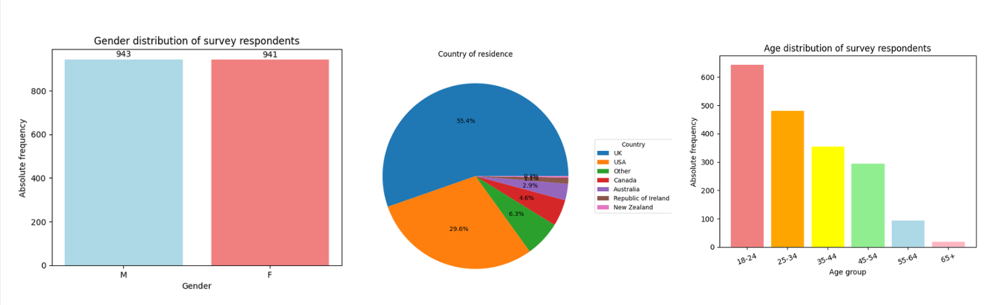
</p>
<p align="center"><em>Figure 1 - Demographic distribution: gender, age group, and country of residence.</em></p>

---

### Personality Scores

All seven personality scores are approximately normally distributed and centred near zero, consistent with their z-score standardisation. The close alignment of mean and median across all features confirms approximate symmetry.

<p align="center">
  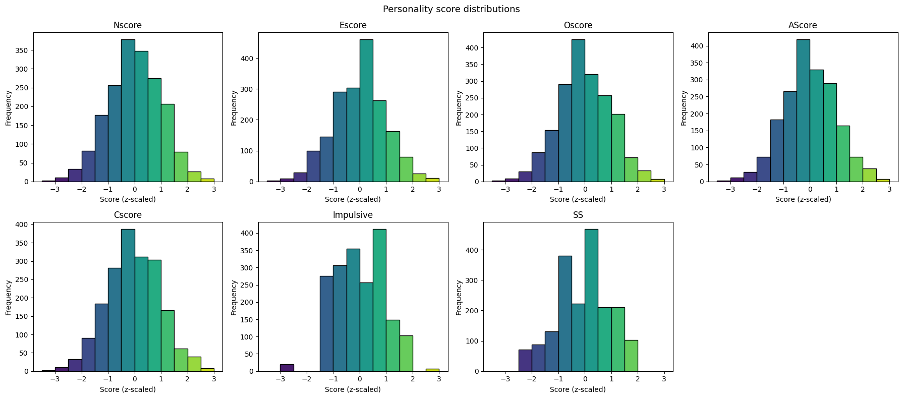
</p>
<p align="center"><em>Figure 2 - Distribution of the seven personality scores.</em></p>

| Feature | Mean | Median | Std Dev | IQR |
|---|---:|---:|---:|---:|
| Nscore (Neuroticism) | −0.0001 | 0.0426 | 0.998 | 1.308 |
| Escore (Extraversion) | 0.0001 | 0.0033 | 0.997 | 1.333 |
| Oscore (Openness) | −0.0002 | −0.0193 | 0.996 | 1.441 |
| AScore (Agreeableness) | 0.0002 | −0.0173 | 0.997 | 1.367 |
| Cscore (Conscientiousness) | −0.0004 | −0.0066 | 0.998 | 1.237 |
| Impulsive | 0.0073 | −0.2171 | 0.954 | 1.241 |
| SS (Sensation Seeking) | −0.0027 | 0.0799 | 0.963 | 1.291 |

---

### Legal vs. Illegal Substances

Legal substances show substantially higher recent use than illegal ones. Caffeine leads with **73.5%** of respondents at CL6 (last day), while Heroin has **85.1%** at CL0 (never used).

<p align="center">
  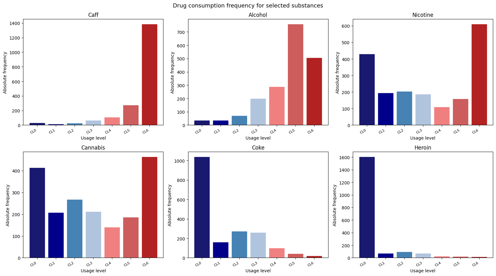
</p>
<p align="center"><em>Figure 3 - Consumption frequency for selected substances across the legal–illegal spectrum.</em></p>

---

### Sensation Seeking Across Age Groups

Sensation Seeking declines monotonically with age - from a mean of **+0.40** in the 18–24 group to **−0.97** in the 65+ group - consistent with established findings in personality psychology.

<p align="center">
  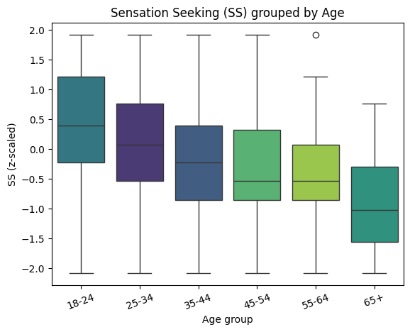
</p>
<p align="center"><em>Figure 4 - Mean Sensation Seeking score by age group, with reference line at z = 0.</em></p>

---

### Outlier Detection

Two methods were applied: the **3-sigma rule** (Definition 5.1.1) and the **IQR rule** (Definition 5.1.3). Both identify only a small number of extreme values per feature (≤ 1.3% of observations). Given that scores originate from a validated psychometric instrument, these extremes most plausibly represent genuine individual differences rather than measurement errors - **removal is not justified**.

<p align="center">
  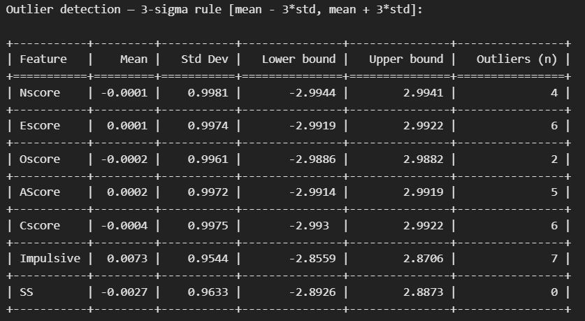
</p>
<p align="center"><em>Figure 5 - Boxplot overview of all personality features; points beyond the whiskers are flagged by the IQR rule.</em></p>

---

### Key Findings Summary

| # | Finding |
|:---:|---|
| 1 | **No missing values** - mandatory survey design ensured complete data across all 1,884 rows |
| 2 | **Sample skew** - younger respondents (18–34) and UK-based participants are overrepresented |
| 3 | **Normal personality distributions** - all scores centred near zero with std ≈ 1 |
| 4 | **Clear legal/illegal divide** - Caffeine and Alcohol heavily used; hard drugs rarely so |
| 5 | **Age–SS relationship** - Sensation Seeking decreases steadily from 18–24 to 65+ |
| 6 | **Outliers retained** - few in number and plausibly genuine; robust measures preferred |
| 7 | **Valid responses** - Semer fictitious drug claimed by only 0.4% of participants |

---

## Part 2 - Classification

Building on the EDA hypothesis that personality traits predict substance exposure, this phase formalises a binary prediction task and contrasts two classifiers: **Decision Tree** and **k-Nearest Neighbour**.

---

### Classification Task

The target variable is constructed by binarising the Cannabis column at the `CL0` boundary:

- **Class 0 - Non-user**: respondents reporting `CL0` (never used Cannabis).
- **Class 1 - User**: respondents reporting any of `CL1`-`CL6` (used at least once).

| Class | Count | Proportion |
|---|---:|---:|
| Non-user (0) | 412 | 21.9% |
| User (1) | 1,472 | 78.1% |

The target classes are moderately imbalanced, motivating the use of weighted F1 alongside accuracy and **stratified** k-fold cross-validation.

---

### Methodology

**Predictors:** 7 personality z-scores + 5 demographic features (2 ordinal-encoded, 3 one-hot), yielding a 25-column feature matrix. All drug columns are excluded to prevent data leakage.

**Preprocessing:** ordinal integer encoding for Age and Education; one-hot dummies for Gender, Country, and Ethnicity; Min-Max scaling of the full feature matrix for kNN (invariant for the Decision Tree).

**Validation:** Stratified 5-fold cross-validation (`random_state=42`); hyperparameters tuned by maximising mean weighted F1 across folds.

---

### Cross-Validation Results


<p align="center">
  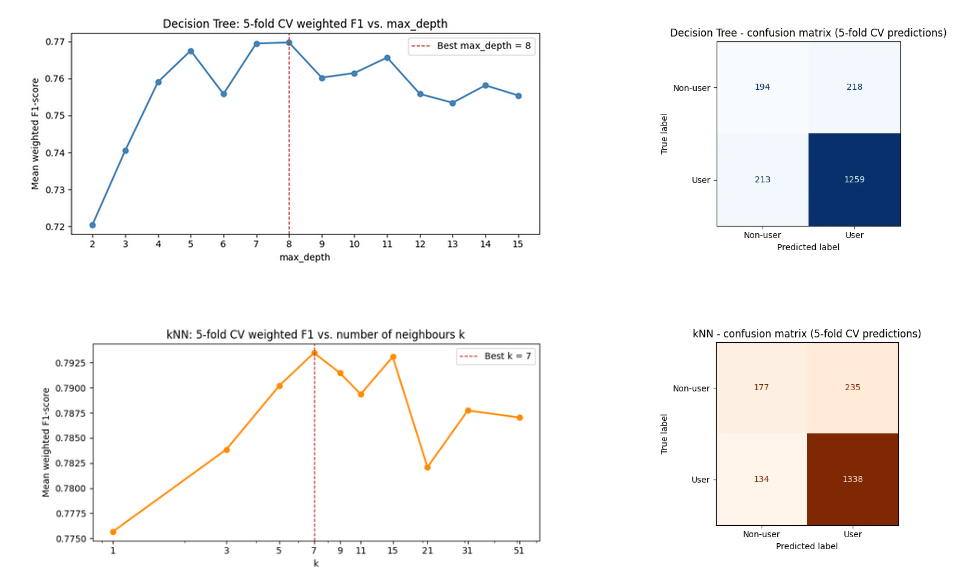
</p>
<p align="center"><em>Figure 6 - Model comparison of accuracy & F1-score between Decision Tree & kNN.</em></p>

| Classifier | Tuned parameter | Accuracy | Weighted F1 |
|---|:---:|---:|---:|
| Decision Tree (`criterion=entropy`) | `max_depth = 8` | 0.7712 ± 0.0155 | 0.7697 ± 0.0133 |
| k-Nearest Neighbour (*Euclidean*) | `k = 7` | 0.8041 ± 0.0123 | 0.7935 ± 0.0143 |

> A majority-class baseline would yield 78.1% accuracy. The Decision Tree sits close to this ceiling; kNN clears it by ~2.6%. Both models identify *users* well (recall ≈ 86 - 91%) but struggle on the minority *non-user* class (recall ≈ 43 - 47%).

---

### Feature Importance

Two complementary methods are applied: **impurity-based importance** (Decision Tree) and **permutation importance** (kNN, 10 repeats, drop in weighted F1).

<p align="center">
  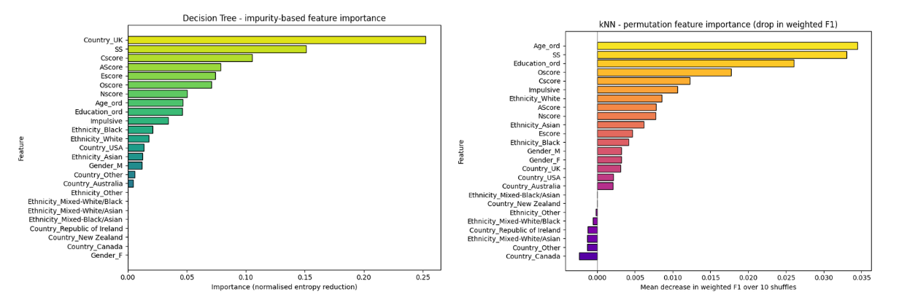
</p>
<p align="center"><em>Figure 7 - Feature importance comparison between Decision Tree & kNN.</em></p>

| Rank | Decision Tree - impurity reduction | kNN - permutation drop in F1 |
|:---:|---|---|
| 1 | Country_UK (0.2526) | SS - Sensation Seeking (0.0388) |
| 2 | SS - Sensation Seeking (0.1513) | Age_ord (0.0201) |
| 3 | Cscore - Conscientiousness (0.1054) | Oscore - Openness (0.0186) |

The class-conditional means of the top personality features confirm real but modest effect sizes:

| Feature | Non-users | Users | Difference |
|---|---:|---:|---:|
| SS (Sensation Seeking) | -0.652 | +0.179 | +0.831 |
| Oscore (Openness) | -0.579 | +0.162 | +0.741 |
| Age_ord | 1.981 | 1.168 | -0.813 |
| Cscore (Conscientiousness) | +0.451 | -0.127 | -0.577 |

---

### Key Findings Summary

| # | Finding |
|:---:|---|
| 1 | **kNN outperforms the Decision Tree**: 80.4% vs 77.1% accuracy; 0.7935 vs 0.7697 weighted F1 under 5-fold CV |
| 2 | **Sensation Seeking is the strongest and most reliable predictor**: top-ranked by kNN permutation importance and second by the Decision Tree |
| 3 | **Country_UK distorts tree splits**: the Decision Tree places it first due to sample over-representation (55% UK), not a causal mechanism |
| 4 | **Minority class recall is the key limitation**: non-user recall of 43 - 47% reflects the 76/24 class imbalance and the modest effect sizes of personality predictors (~0.6 - 0.8 SD difference) |
| 5 | **EDA hypothesis partially confirmed**: Sensation Seeking, Openness, and younger age are associated with Cannabis use, but effect sizes are insufficient to override the class prior for borderline profiles |

---

## Part 3 - Regression

Extending the finding that **Sensation Seeking (SS)** is the most informative personality trait across both previous phases, this phase shifts the question from *what does SS predict?* to **what explains SS itself?**. SS is chosen as the dependent variable and three regression models of increasing scope are built and compared.

---

### Regression Task

The seven personality z-scores are the only genuinely continuous features, making them the natural candidates for regression. SS is selected as the target because it was the strongest correlate of substance use in the EDA and the top-ranked feature in the classification. Three models each answer a distinct question:

- **Model 1 - Simple linear** (`SS ~ Impulsive`): how much does the single strongest correlate explain?
- **Model 2 - Multiple linear** (`SS ~ 6 personality scores + Age`): how much do all traits together explain, and what is each one's contribution holding the others constant?
- **Model 3 - Polynomial** (`SS ~ Age`, degrees 1-4): is the age-related decline of SS linear or curved?

---

### Correlation Analysis

Pairwise Pearson correlations among the seven scores and ordinal Age were screened first. SS sits at the centre of the correlation structure, participating in the three strongest relationships of interest: **Impulsive (r = 0.623)**, **Openness (r = 0.422)** and **Age (r = -0.327)**.

<p align="center">
  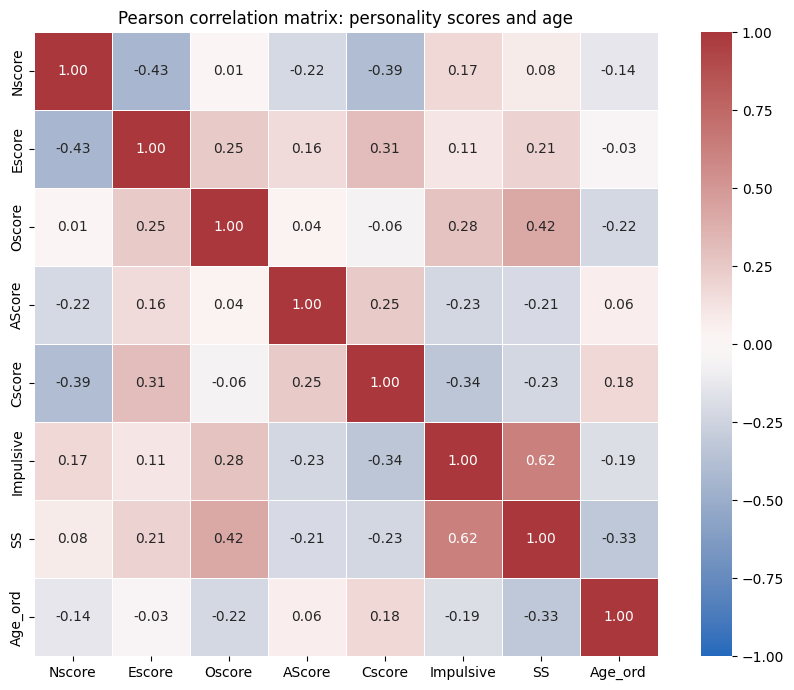
</p>
<p align="center"><em>Figure 8 - Pearson correlation matrix of the seven personality scores and ordinal age.</em></p>

The dominant Impulsive-SS pair is **not** a spurious effect of age: the partial correlation controlling for Age (**0.606**) is almost identical to the raw 0.623. A conceptual caveat remains - BIS-11 Impulsivity and ImpSS Sensation Seeking both originate from the impulsivity domain, so part of the association is construct overlap rather than an independent mechanism.

---

### Methodology

**Validation:** plain **5-fold cross-validation** (`KFold`, `random_state=42`) replaces the stratified variant used in classification because the target is continuous. Every model is scored from out-of-fold predictions on three complementary criteria: **R²** (share of explained variance), **RMSE** (penalising large errors) and **MAE** (robust to outliers). Country, Ethnicity and Gender are deliberately excluded - the question concerns the structure *within* the personality profile.

---

### Model 1 - Simple Linear Regression (`SS ~ Impulsive`)

The fitted equation is **SS = -0.007 + 0.629 × Impulsive**: a one-SD rise in Impulsivity is associated with a 0.63 SD rise in SS. The model explains **R² = 0.388** on full data, with a near-identical cross-validated **0.385 ± 0.029** - a one-parameter model cannot overfit 1,884 observations. The residuals-versus-fitted plot is centred on zero with no funnel shape or curvature, confirming the linear form is adequate; the vertical banding reflects the discrete BIS-11 instrument.

<p align="center">
  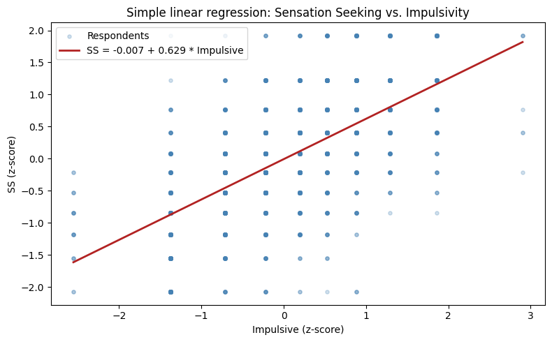
  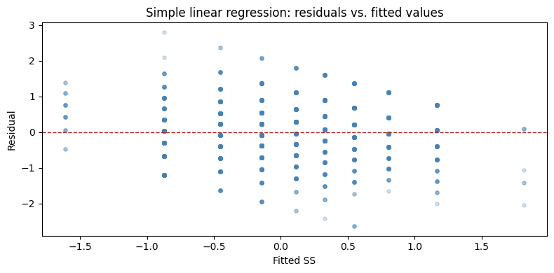
</p>
<p align="center"><em>Figure 9 - Simple linear regression fit (left) and residuals vs. fitted values (right).</em></p>

---

### Model 2 - Multiple Linear Regression (7 predictors)

Pooling all traits and Age raises the explained variance to **R² = 0.505** (adjusted 0.503, cross-validated **0.500 ± 0.032**, RMSE = 0.680) - the best model on every criterion. The coefficients, adjusted for all other predictors, are informative:

| Predictor | Coefficient | Reading |
|---|---:|---|
| Impulsive | +0.485 | Dominant, but shrinks from 0.629 - part of its raw effect was shared with Openness and Age |
| Oscore (Openness) | +0.217 | Genuine independent signal |
| Escore (Extraversion) | +0.111 | Genuine independent signal |
| Age_ord | -0.131 | Confirms the EDA decline as an independent effect |
| AScore (Agreeableness) | -0.105 | Modest |
| Cscore (Conscientiousness) | -0.040 | Negligible once other traits controlled |
| Nscore (Neuroticism) | -0.019 | Negligible once other traits controlled |

<p align="center">
  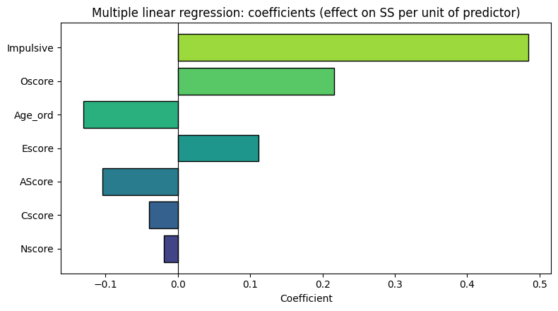
  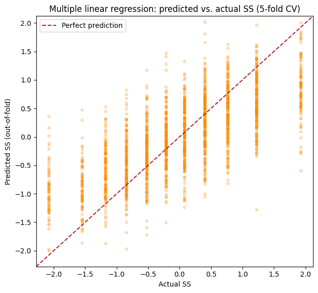
</p>
<p align="center"><em>Figure 10 - Adjusted coefficients (left) and out-of-fold predicted vs. actual SS (right).</em></p>

The predicted-versus-actual plot shows the characteristic R² ≈ 0.5 signature: clear alignment along the diagonal, but predictions compressed toward the mean, so extreme SS values are rarely reproduced.

---

### Model 3 - Polynomial Regression (`SS ~ Age`)

Cross-validated R² is essentially **flat across degrees 1-4 (≈ 0.10-0.11)** - every gain beyond degree 1 is far smaller than one standard deviation of the CV scores. By the parsimony principle, degree 2 is retained only to demonstrate that curvature is negligible: the linear and quadratic fits are visually indistinguishable and both track the age-group means closely, with only a hint of flattening in the two oldest groups.

<p align="center">
  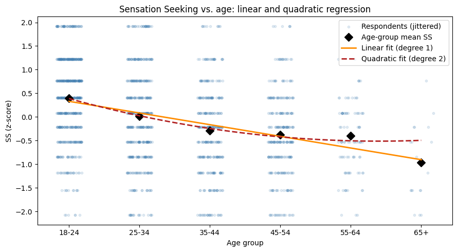
</p>
<p align="center"><em>Figure 11 - Sensation Seeking vs. age with linear and quadratic fits over the jittered data and age-group means.</em></p>

The decline of SS with age is **essentially linear**, resolving the functional-form question left open by the EDA. However, Age alone explains only **≈ 10%** of the SS variance - the effect is systematic at the group level but weak at the individual level.

---

### Model Comparison

| Model | CV R² | CV RMSE | CV MAE |
|---|:---:|---:|---:|
| 1. Simple linear (`SS ~ Impulsive`) | 0.385 ± 0.029 | 0.754 | 0.597 |
| **2. Multiple linear (7 predictors)** | **0.500 ± 0.032** | **0.680** | **0.537** |
| 3. Polynomial (`SS ~ Age`, degree 2) | 0.103 ± 0.044 | 0.909 | 0.723 |

> The multiple regression wins on every criterion. The ranking is itself informative: most of the explainable signal sits in **Impulsivity alone** (0.38 of the total 0.50), the remaining traits and age add a moderate but genuine +0.12 R², and age by itself is a weak predictor whose information is largely absorbed by the personality scores.

---

### Predictions for New Data

The two hypothetical respondents from the classification phase are reused, so the assumed SS values (±1.5) serve as a plausibility reference for the predicted ones.

| Respondent | Model 1 (simple) | Model 2 (multiple) | Assumed |
|---|---:|---:|---:|
| A (young, high Impulsive/Openness) | +0.748 | +1.139 | +1.5 |
| B (older, low Impulsive/Openness) | -0.636 | -1.129 | -1.5 |

Direction and order are correct, all values lie inside the observed SS range (-2.08 to +1.92), and the attenuation toward the mean (≈ ±1.13 vs. the assumed ±1.5) is exactly what an R² = 0.5 model should produce - it predicts the *expected* SS given the profile, treating extreme profiles conservatively.

---

### Key Findings Summary

| # | Finding |
|:---:|---|
| 1 | **SS is the hub of the personality correlation structure**: its strongest correlate is Impulsivity (r = 0.623), and the partial correlation controlling for age (0.606) shows the relationship is not spurious |
| 2 | **Multiple linear regression is the best model**: CV R² = 0.500 ± 0.032 (RMSE 0.68), against 0.385 for the Impulsivity-only baseline and 0.103 for the age-only model |
| 3 | **Impulsivity dominates, but Openness, Extraversion and Age add genuine independent signal**; Neuroticism and Conscientiousness contribute almost nothing once other traits are controlled |
| 4 | **The age-related decline of SS is essentially linear** - no cross-validated gain beyond degree 1 - resolving the functional-form question left open by the EDA |
| 5 | **Predictions for new data are sensible** in sign, order and magnitude, with the expected attenuation toward the mean; half of the SS variance nonetheless remains unexplained, and the design is purely correlational |

---

## Repository Structure

```
drug-consumption-analysis/
│
├── explorative-data-analysis/
│   ├── EDAnotebook.ipynb                # Jupyter Notebook - Part 1
│   └── explorative-data-analysis.pdf    # Documentation - Part 1
│
├── classification/
│   ├── classification-notebook.ipynb    # Jupyter Notebook - Part 2
│   └── classification.pdf               # Documentation - Part 2
│
├── regression/
│   ├── regression.ipynb                 # Jupyter Notebook - Part 3
│   └── regression.pdf                   # Documentation - Part 3
│
├── results/
│   └── *.png                            # Output figures
│
├── .gitignore
├── Drug_Consumption.csv                 # Dataset
└── README.md
```

---

## Dependencies

```python
import os
import numpy as np
import pandas as pd
import matplotlib.pyplot as plt
from sklearn.preprocessing import LabelEncoder, MinMaxScaler
from sklearn.model_selection import StratifiedKFold, cross_val_score, cross_val_predict
from sklearn.metrics import confusion_matrix, ConfusionMatrixDisplay, classification_report
from sklearn import tree
from sklearn.neighbors import KNeighborsClassifier, NearestNeighbors
from sklearn.inspection import permutation_importance
from IPython.display import display, Markdown
```

---

## Reference

Fehrman, E., Muhammad, A. K., Mirkes, E. M., Egan, V., & Gorban, A. N. (2017). *The Five Factor Model of personality and evaluation of drug consumption risk.* In Palumbo, Montanari & Vichi (Eds.), Data Science: Innovative Developments in Data Analysis and Clustering (pp. 231–242). Springer.

Dataset available at: [UCI ML Repository - Drug Consumption (Quantified)](https://archive.ics.uci.edu/dataset/373/drug+consumption+quantified)
